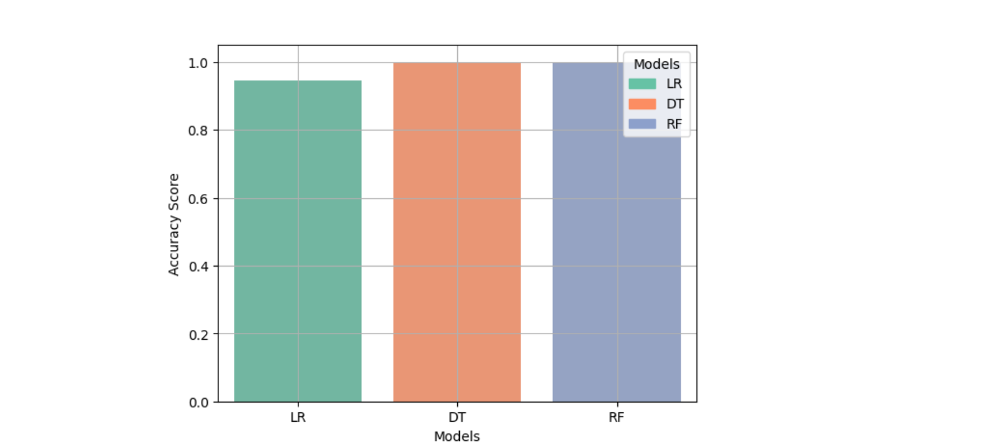
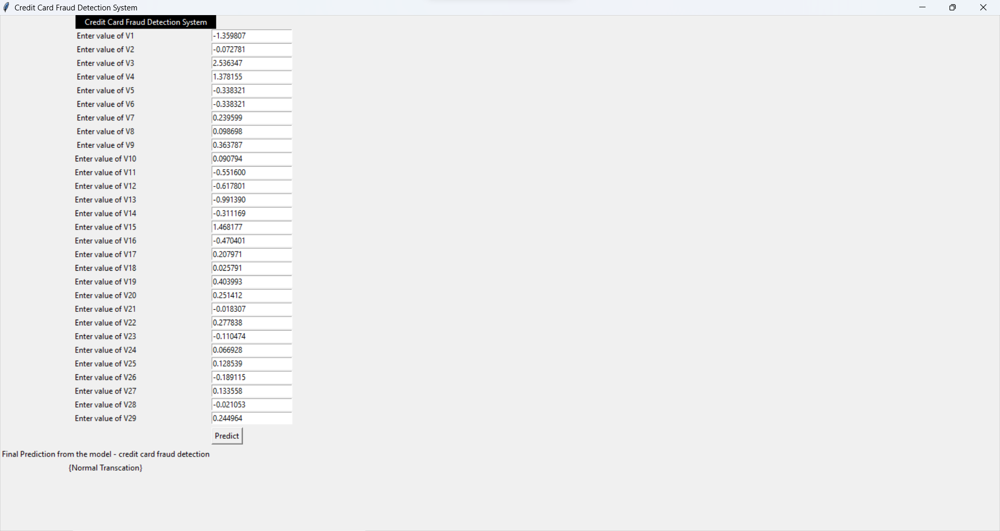

# Credit Card Fraud Detection System with Tkinter GUI and Random Forest

This project is a **Credit Card Fraud Detection System** built using a machine learning model (Random Forest) and a graphical user interface (GUI) with **Tkinter**. The system allows users to input transaction data manually and predicts whether the transaction is fraudulent or not.

## Features
- **Tkinter GUI**: A simple user interface to input transaction features (V1-V29).
- **Model Prediction**: Predicts whether a transaction is **normal** or **fraudulent** using a pre-trained Random Forest model.
- **CSV Loading**: You can load transaction data directly from a CSV file.
- **Optimized Performance**: Random Forest achieved the highest accuracy among other models like Logistic Regression and Decision Tree.

## Dataset
The model was trained on a [Credit Card Fraud Detection dataset](https://www.kaggle.com/mlg-ulb/creditcardfraud), which consists of 28 anonymized features (V1-V28) along with `Amount` and `Time` features. The dataset is highly imbalanced, with a very small proportion of fraudulent transactions.

## How to Run the Project

1. **Clone the Repository**
   ```bash
   git clone https://github.com/nitheesh2509/Credit-Card-Fraud-Detection-System-with-Tkinter-GUI-and-Optimized-Random-Forest-Model.git
   cd Credit-Card-Fraud-Detection-System-with-Tkinter-GUI-and-Optimized-Random-Forest-Model
   ```

2. **Set up the Python Environment**
   Ensure that you have Python installed. You can install the required dependencies using the command:
   ```bash
   pip install -r requirements.txt
   ```

3. **Run the Application**
   1. **Launch Jupyter Notebook**  
      If you have Jupyter installed, you can open the project by running the following command:
      ```bash
      jupyter notebook
      ```
      
   2. **Open the Notebook**  
      In the Jupyter interface, navigate to the `Credit-Card-Fraud-Detection-System-with-Tkinter-GUI-and-Optimized-Random-Forest-Model.ipynb` file and open it.

   3. **Run the Cells**  
      Execute all cells in the notebook to load the pre-trained model, set up the Tkinter GUI, and interact with the application. The GUI will appear after you run the Tkinter section of the notebook.

   4. **Load Data from CSV (Optional)**  
      The system also allows you to load transaction data from a CSV file. Ensure the CSV file is properly formatted with columns matching the features used in the model.

## Model Details
- **Algorithm Used**: Random Forest Classifier
- **Performance**: Random Forest provided the highest accuracy compared to Logistic Regression and Decision Tree models.
- **Pre-trained Model**: The model is saved as `Credit_card_fraud_final_model.pkl` using `joblib`.

## Dependencies
The project requires the following dependencies:
- **Tkinter**: For building the GUI.
- **joblib**: To load the trained model.
- **scikit-learn**: For machine learning algorithms.
- **numpy**: For numerical operations.
- **pandas**: For data manipulation.
- **matplotlib**: For data visualization.
- **seaborn**: For enhanced data visualization.

## Screenshots



## License
This project is licensed under the MIT License.
